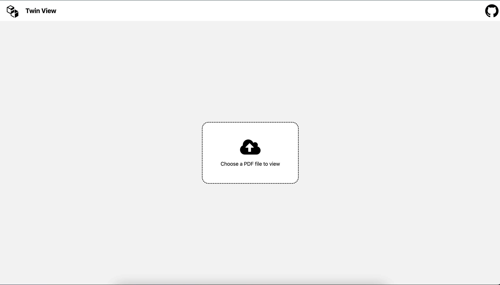

# Twin View - double the views for the same PDF

Online PDF reader that shows _two independent views for the same file_. This allows one to easily navigate a file and use the other as a reference. The reader supports PDFs and images.

[TwinView website (demo)](http://twinview.surge.sh)

## Screenshots

## Credits

- [Svelte](https://svelte.dev)
- [pdfjs.express](https://pdfjs.express)
- [Svelte-Splitpane](https://orefalo.github.io/svelte-splitpanes/)
- [svelte-file-dropzone](https://www.npmjs.com/package/svelte-file-dropzone)
- [daisyUI](https://daisyui.com)
- [Fontawesome](https://fontawesome.com/v4/icons/)

## Author

[MAKinteract](https://makinteract.kaist.ac.kr)

## License

MIT
